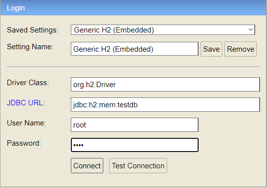
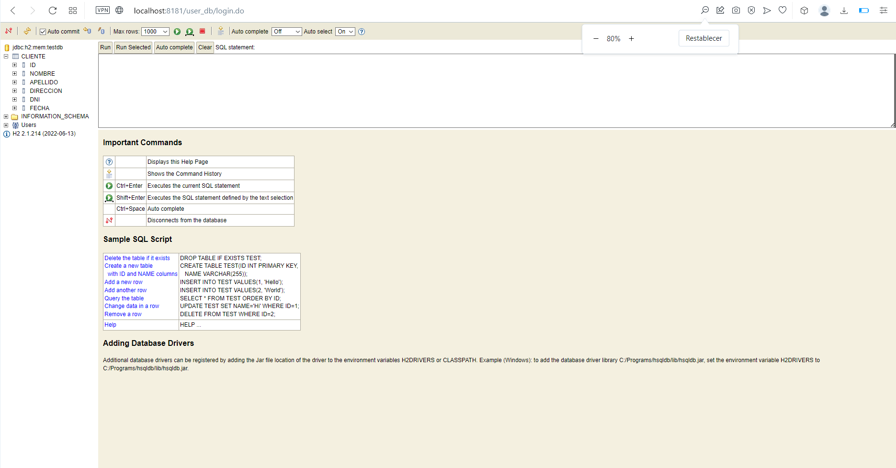

# UD24-SPRING
UD24 - Spring REST

#### *Postman test endpoints*
```
GET
localhost:8181/api/clientes
localhost:8181/api/clientes/nombre/Jose
localhost:8181/api/clientes/4

POST
localhost:8181/api/clientes

PUT
localhost:8181/api/clientes/1

DELETE
localhost:8181/api/clientes/6
```
#### *H2 Database Engine*


